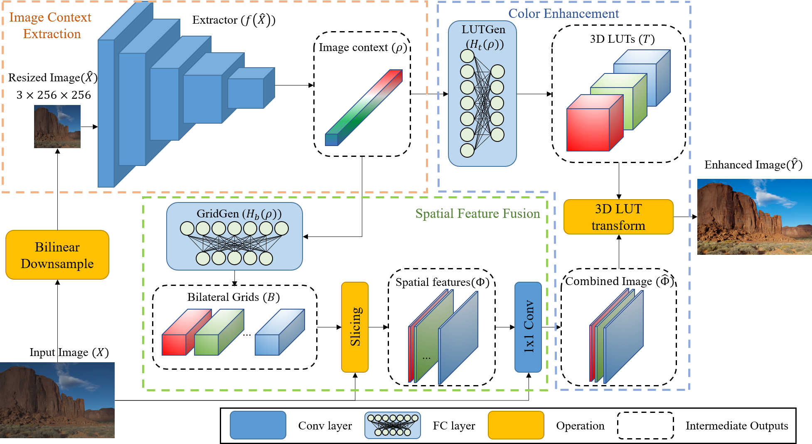

# Image-adaptive 3D Lookup Tables for Real-time Image Enhancement with Bilateral Grids

## Introduction
The project provides the official PyTorch implementation with pretrained models for the paper "[Image-adaptive 3D Lookup Tables for Real-time Image Enhancement with Bilateral Grids](https://www.ecva.net/papers/eccv_2024/papers_ECCV/html/6517_ECCV_2024_paper.php)" (accepted by ECCV 2024).

<p align="center"></p>

Image enhancement and restoration methods using adaptive 3D lookup tables (3D LUTs) have shown promising results with real-time inferencing. These methods directly transform input pixel values into enhanced ones by using interpolation operations with predicted 3D LUT values. However, it is still challenging to deal with locally different properties of images since most 3D LUT methods are simple color-to-color transforms. Although including spatial information in this transform can be a good solution, it can significantly increase the number of parameters and inference time. To address this issue, we propose an efficient spatial-aware image enhancement model that combines bilateral grids and 3D LUTs. Specifically, we transform bilateral grids into a spatial feature domain to incorporate spatial information in our 3D LUT model. To reduce inference time and save parameters, we use slicing operations in our network architecture instead of the long decoding path of the U-Net architecture used in most existing studies. Our model achieves state-of-the-art performance without increasing parameters and further reduces inference time, as demonstrated by extensive results.

## Environment
- Ubuntu 18.04.5 LTS
- pytorch
- CUDA 11.8 & CUDA toolkit
- Python 3.8 or later

## Structure
```
dataset/fiveK
       /ppr10k
project/LUTwithBGrid
       demo_img/                      # image for demo
       kerenel_code/                  # extension codes for lut transform and slicing
       lpips/
       pretrained/                    # pretrainded models
       utils/                         # matlab files for evaluation etc.
       cpp_ext_interface.py           # python interfaces for extension code
       datasets.py                    # codes for dataset classes
       demo.py                        # simple demostration
       evaluate.py                    # evaluation code
       model_losses.py                # losses for our model
       models.py                      # implementaion code for our model
       torchvision_x_functional.py
       train.py                       # train code
```

## Installation
- Setup proper version of [Pytorch](https://pytorch.org/get-started/locally/) and [CUDA-toolkit](https://anaconda.org/nvidia/cuda-toolkit) depend on your environment.
- Install the other packages that are required for our model. Refer to `requirements.txt` or using following command:  

```shell
pip install scipy kornia tqdm opencv-python pillow
```

- Compile and install the extension for LUT transform and Bilateral grid slicing. 
```shell
python ./kernel_code/lut_transform/setup.py install
python ./kernel_code/bilateral_slicing/setup.py install 
```

## Datasets
```
dataset/fiveK
        input/
             JPG/480p/                 # sRGB inputs
             PNG/480p_16bits_XYZ_WB/   # XYZ inputs
        expertC/JPG/480p/              # GT
        train.txt                      
        test.txt

       /ppr10k
        train/
             masks/                    # masks for train
             source/                   # sRGB inputs for train
             source_aug/               # sRGB inputs with 5 versions of augmented images for train 
             target_a/                 # GT of expert a for train
             target_b/                 # GT of expert b for train
             target_c/                 # GT of expert c for train
        val/
             masks/                    # masks for test
             source/                   # sRGB inputs for test
             target_a/                 # GT of expert a for test
             target_b/                 # GT of expert b for test
             target_c/                 # GT of expert c for test
```

The [FiveK](https://data.csail.mit.edu/graphics/fivek/) and [PPR10K](https://github.com/csjliang/PPR10K) datasets are used for experiments. </br>
The [3D-LUT](https://github.com/HuiZeng/Image-Adaptive-3DLUT) project also provides 480p version of FiveK to speed up in the training stage. 

## Demo
You can execute a simple demonstration using the following command: 
```shell
python demo.py 
```
This demonstration code enhances an input image (`./demo_img/input/a0634.jpg`) and saves the result (`./demo_img/result/a0634.png`). </br>
Or you can specify the pretrained model, input image path, and output image path.
```shell
python demo.py --pretrained_path=[pretrained model path] --input_path=[input image path] --output_path=[output image path]
```
## Train
- General Train
```shell
python train.py --dataset_name=[fiveK of ppr10k] --input_color_space=[sRGB or XYZ] --batch_size=[batch size] 
```

- FiveK sRGB photo retouching
```shell
python train.py --dataset_name=fiveK --input_color_space=sRGB
```

- FiveK XYZ tone mapping
```shell
python train.py --dataset_name=fiveK --input_color_space=XYZ
```

- PPR10K sRGB photo retouching
```shell
python train.py --dataset_name=ppr10k --input_color_space=sRGB --batch_size=16 --lut_n_ranks=10
```

## Evaluation
1. Generate and save the test images using the following command:
```shell
python evaluate.py --pretrained_path=[path of pretrained model] --dataset_name=[fivek or ppr10k] --input_color_space=[sRGB or XYZ] 
```

We provide pretrained models in `./pretrained/`. 

2. Calculate the score using Matlab code
   - FiveK
     ```shell
     (matlab) > ./utils/fivek_calculate_metrics.m [evaluate image dir] [GT dir]
     ```
   - PPR10K
     ```shell
     (matlab) > ./utils/ppr10k_calculate_metrics.m [evaluate image dir] [GT dir] [mask dir]
     ```

## Citation
```
@inproceedings{kim2024LUTwithBGrid,
  title={Image-adaptive 3D Lookup Tables for Real-time Image Enhancement with Bilateral Grids},
  author={Kim, Wontae and Cho, Nam Ik},
  booktitle={European Conference on Computer Vision},
  year={2024}
}
```

## Acknowledgements
This project is based on the following open-source projects. We sincerely appreciate their authors for allowing us to use their excellent works as open-source.
- [3D-LUT](https://github.com/HuiZeng/Image-Adaptive-3DLUT)
- [PPR10K](https://github.com/csjliang/PPR10K)
- [AdaInt](https://github.com/ImCharlesY/AdaInt)
- [LPIPS](https://github.com/richzhang/PerceptualSimilarity)
